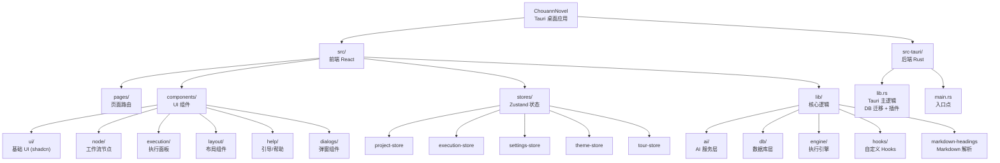

# ChouannNovel - AI 辅助小说创作工作流平台

> 最后更新: 2026-02-12 04:07:00

## 项目愿景

ChouannNovel 是一款面向小说创作者的 AI 辅助工作流桌面应用。通过可视化的工作流编辑器，用户可以构建自定义的 AI 写作流程（包括多步 AI 对话、条件分支、循环迭代、并发执行等），结合角色设定库、世界观管理、大纲系统等功能，实现高效的 AI 辅助小说创作。

## 技术栈

| 层次 | 技术 | 版本 |
|------|------|------|
| 桌面框架 | Tauri | v2 |
| 前端框架 | React | v19.1 |
| 语言 | TypeScript / Rust | TS ~5.8 / Rust 2021 |
| 构建工具 | Vite | v7 |
| 样式 | Tailwind CSS | v4 |
| 状态管理 | Zustand | v5 |
| UI 组件库 | shadcn/ui (Radix UI) | new-york 风格 |
| AI SDK | Vercel AI SDK | v5 |
| AI 提供商 | OpenAI, Google Gemini, Anthropic Claude | - |
| 数据库 | SQLite (Tauri 原生 / sql.js Web 降级) | - |
| 单元测试 | Vitest | v4 |
| E2E 测试 | Playwright | v1.57 |
| 动画 | Framer Motion | v12 |
| 图标 | Lucide React | - |
| 拖拽 | dnd-kit | v6/v10 |
| 虚拟滚动 | @tanstack/react-virtual | - |

## 架构总览



## 模块索引

| 模块 | 路径 | 职责 | 语言 |
|------|------|------|------|
| 前端应用 | `src/` | React SPA, 页面/组件/状态/业务逻辑 | TypeScript/TSX |
| Tauri 后端 | `src-tauri/` | 桌面壳层, SQLite 迁移, 原生插件注册 | Rust |

### 前端子模块

| 子模块 | 路径 | 职责 |
|--------|------|------|
| 页面 | `src/pages/` | 11 个页面文件: 首页, 项目详情/编辑, 工作流编辑/新建, 设定库(三栏布局), 全局设置(连接测试+模型管理), 执行历史等 |
| UI 组件 | `src/components/ui/` | 28+ 个 shadcn/ui 基础组件 + 5 个自定义组件 (PromptEditor, VariablePicker, VirtualList, LazyImage, MarkdownRenderer) |
| 节点组件 | `src/components/node/` | WorkflowNodeTree (1361行, 可视化节点列表+拖拽), NodeConfigDrawer (600行, 统一配置抽屉), 9 种节点配置面板 |
| 执行组件 | `src/components/execution/` | StreamingOutput (流式输出+Markdown渲染+编辑), WorkflowGuide (操作指引+快捷键), CollapsedOutputIndicator (折叠状态指示) |
| 布局组件 | `src/components/layout/` | MainLayout (自定义路由+侧边栏自动隐藏), Sidebar (项目树+搜索), Header (面包屑导航), AppErrorBoundary, GlobalErrorListener |
| 帮助组件 | `src/components/help/` | ShortcutsDialog (上下文感知快捷键), Tour/TourSpotlight/TourTooltip (交互式引导教程) |
| 弹窗组件 | `src/components/dialogs/` | CreateProjectDialog, CreateWorkflowDialog (侧边栏快捷创建) |
| AI 服务 | `src/lib/ai/` | 统一 AI 接口 (chat/stream), 多提供商适配, Tauri HTTP 绕过 CORS, 连接测试, Base URL 智能补全 |
| 数据库层 | `src/lib/db/` | CRUD 操作, Tauri SQL + Web SQL 双端适配 |
| 执行引擎 | `src/lib/engine/` | ExecutionContext + WorkflowExecutor, 节点执行调度 |
| 自定义 Hooks | `src/lib/hooks/` | 热键, 节点选择(多选/范围选), 工作流历史, 运行按钮状态 |
| Markdown 解析 | `src/lib/markdown-headings.ts` | Markdown 标题树形解析, 用于设定内容层级展示 |
| 状态管理 | `src/stores/` | 5 个 Zustand Store (项目/执行/设定/主题/引导) |
| 类型定义 | `src/types/` | 全局 TypeScript 接口与类型 |
| 引导教程 | `src/tours/` | 首页/工作流/AI配置/设置引导步骤 |
| 测试 Mock | `src/test/` | Tauri/AI/DB Mock + 测试 setup |

## 数据模型

应用使用 SQLite 数据库，包含以下核心表:

| 表名 | 用途 | 关键字段 |
|------|------|----------|
| `projects` | 项目 | id, name, description |
| `workflows` | 工作流 | id, project_id, name, loop_max_count, timeout_seconds |
| `nodes` | 工作流节点 | id, workflow_id, type, name, config(JSON), order_index, block_id |
| `settings` | 设定库 | id, project_id, category, name, content, enabled, **parent_id**, **order_index** |
| `setting_prompts` | 设定注入提示词 | id, project_id, category, prompt_template |
| `global_config` | 全局配置 | id=1, ai_providers(JSON), theme |
| `executions` | 执行记录 | id, workflow_id, status, final_output, variables_snapshot |
| `node_results` | 节点执行结果 | id, execution_id, node_id, input, output, resolved_config |
| `workflow_versions` | 工作流版本历史 | id, workflow_id, version_number, snapshot(JSON) |

### 数据库迁移

| 版本 | 描述 | 内容 |
|------|------|------|
| v1 | 初始 schema | 9 张表 + 15 个索引 |
| v2 | 设定库层级化 | `settings` 表新增 `parent_id` (TEXT, 可空) 和 `order_index` (INTEGER, 默认 0) 列, 新增 `idx_settings_parent_id` 索引 |

### 节点类型

| 类型 | 说明 | 配置面板 |
|------|------|----------|
| `start` | 开始流程, 定义全局变量/自定义变量 | 内联于 NodeConfigDrawer |
| `output` | 输出节点 (纯文本/Markdown) | 内联于 NodeConfigDrawer |
| `ai_chat` | AI 对话 (支持流式输出, 多提供商, 对话历史, 设定注入) | AIChatConfig.tsx |
| `text_extract` | 文本提取 (正则/标记/JSON路径/MD转纯文本) | TextExtractConfig.tsx |
| `text_concat` | 文本拼接 (多来源+分隔符, 支持数据迁移) | TextConcatConfig.tsx |
| `var_update` | 更新全局变量 | 内联于 NodeConfigDrawer |
| `condition` | 条件判断 (旧版, 含动作路由: next/jump/end) | ConditionConfig.tsx |
| `condition_if` / `condition_else` / `condition_end` | 条件分支块 (结构化 if/else/endif) | ConditionIfConfig.tsx |
| `loop` | 循环 (旧版) | LoopConfig.tsx |
| `loop_start` / `loop_end` | 循环块 (计数/条件循环, Slider 1-50) | LoopStartConfig.tsx |
| `parallel_start` / `parallel_end` | 并发执行块 (并发数 1-10, 输出 array/concat) | ParallelConfig.tsx |
| `batch` | 批量执行 (旧版, 分割: 行/分隔符/JSON数组) | BatchConfig.tsx |

## 运行与开发

### 前置条件

- Node.js (支持 ES2020+)
- Rust 工具链 (Tauri 2 要求)
- 系统依赖参考 [Tauri 官方文档](https://tauri.app/start/prerequisites/)

### 常用命令

```bash
# 安装依赖
npm install

# 前端开发 (仅 Web)
npm run dev

# Tauri 桌面开发 (前端 + Rust 后端)
npm run tauri dev

# 构建生产版本
npm run tauri build

# 运行单元测试
npm run test

# 运行测试 (watch 模式)
npm run test:watch

# 查看测试覆盖率
npm run test:coverage

# 测试 UI 面板
npm run test:ui

# E2E 测试 (需先启动 tauri dev)
npm run test:e2e

# E2E 测试 (带界面)
npm run test:e2e:ui
```

### 开发端口

- 前端开发服务器: `http://localhost:1420`
- HMR WebSocket: `ws://localhost:1421`

## 测试策略

| 类型 | 工具 | 位置 | 说明 |
|------|------|------|------|
| 单元测试 | Vitest + jsdom | `src/**/__tests__/*.test.{ts,tsx}` | 核心逻辑、Store、Hooks、组件 |
| E2E 测试 | Playwright | `e2e/*.spec.ts` | 项目/工作流/执行端到端流程 |
| Mock | 自定义 | `src/test/mocks/` | Tauri API / AI SDK / DB 的 Mock |
| 覆盖率 | v8 | `src/lib/**`, `src/stores/**` | 引擎 context.ts 要求 >90% |

### 测试文件统计

- 单元测试: 约 26 个测试文件 (含 markdown-headings.test.ts)
- E2E 测试: 3 个 spec 文件 (project, workflow, execution) + 1 个 fixtures 文件
- 测试 Mock: 3 个 (tauri.ts, ai.ts, db.ts)

### E2E 测试覆盖详情

| 文件 | 覆盖范围 | 关键测试点 |
|------|----------|-----------|
| `project.spec.ts` | 项目 CRUD (282行) | 创建/编辑/删除项目, 确认弹窗, 导航, 列表排序 |
| `workflow.spec.ts` | 工作流编辑 (361行) | 添加各类节点, 配置节点, 删除节点/工作流, 子菜单导航 |
| `execution.spec.ts` | 工作流执行 (359行) | 运行/暂停/恢复/取消, 执行历史, 输出面板, 键盘快捷键 |
| `fixtures/test-data.ts` | 测试基础设施 | data-testid 选择器, generateUniqueName, toastLocator, waitForAnyVisible |

## 编码规范

- **TypeScript**: 严格模式 (`strict: true`), 不允许未使用变量/参数
- **路径别名**: `@/*` 映射到 `./src/*`
- **UI 组件**: 使用 shadcn/ui (new-york 风格), 基于 Radix UI 原语
- **状态管理**: Zustand store, 按领域划分
- **CSS**: Tailwind CSS v4, CSS 变量驱动主题
- **错误处理**: 统一通过 `logError`/`handleAppError`/`handleUnexpectedError` 处理, sonner toast 提示; `AppErrorBoundary` 捕获渲染错误, `GlobalErrorListener` 捕获全局未处理异常
- **变量引用**: 工作流变量使用 `{{变量名}}` 或 `{{@nodeId > 描述}}` 语法
- **构建优化**: 手动 chunk 分割 (vendor-react, vendor-radix, vendor-motion, vendor-ai, vendor-utils)
- **输入安全**: 所有输入框添加 `autoComplete="off"`
- **生产构建**: 移除 console/debugger, 关闭 sourcemap
- **页面导航**: 所有页面组件接受 `onNavigate: (path: string) => void` prop, 不使用 react-router
- **节点配置**: 所有配置面板遵循 `{ config, onChange }` props 模式, 通过 `NodeConfigDrawer` 统一调度
- **网络请求**: Tauri 环境使用 `@tauri-apps/plugin-http` 的 fetch 替代浏览器原生 fetch, 绕过 CORS 限制

## AI 使用指引

### 项目理解要点

1. 这是一个**桌面应用** (Tauri), 不是 Web 应用。前端运行在 WebView 中, 但也支持纯 Web 模式降级 (使用 sql.js 替代 Tauri SQL)
2. 核心业务流程: 项目 -> 工作流 -> 节点 -> 执行。工作流是一组有序节点, 执行引擎按序执行并管理上下文
3. AI 调用通过 Vercel AI SDK 统一封装, 支持 OpenAI/Gemini/Claude 三家, 支持流式输出。**Tauri 环境下使用 plugin-http 的 fetch 绕过 CORS**, 流式调用通过 `onError` 回调捕获 SDK 静默吞掉的错误
4. 数据模型中的 `config` 字段是 JSON, 不同节点类型有不同的配置结构 (见 `src/types/index.ts`)
5. 块结构节点 (循环/并发/条件) 使用 `block_id` 关联开始和结束节点
6. 节点有新旧两套: 旧版 `condition`/`loop`/`batch` 为独立节点; 新版 `condition_if`/`loop_start`/`parallel_start` 为结构化块节点
7. `WorkflowNodeTree` 是最复杂的 UI 组件 (1361行): 支持拖拽排序(dnd-kit)、多选(Ctrl/Shift/全选)、块折叠、右键菜单、变量引用友好显示、节点描述自动生成
8. 设定库支持**层级结构** (parent_id), 在 UI 中以树形展示; 设定内容支持 Markdown 标题解析为可折叠的树形结构
9. **侧边栏自动隐藏**: 在项目子页面(`/project/*`)中, 侧边栏默认隐藏, 鼠标贴近左边缘时以 overlay 形式滑出
10. **连接测试**: SettingsPage 支持对每个 AI 提供商执行真实连接测试, 支持用户指定测试模型, 返回延迟信息和友好中文错误提示

### 文件导航建议

- 理解类型系统: 从 `src/types/index.ts` 开始
- 理解数据流: `src/stores/project-store.ts` -> `src/lib/db/index.ts` -> `src-tauri/src/lib.rs`
- 理解执行引擎: `src/lib/engine/context.ts` -> `src/lib/engine/executor.ts`
- 理解 AI 集成: `src/lib/ai/types.ts` -> `src/lib/ai/index.ts`
- 理解 UI: `src/App.tsx` -> `src/components/layout/MainLayout.tsx` -> `src/pages/`
- 理解节点系统: `src/components/node/WorkflowNodeTree.tsx` -> `src/components/node/NodeConfigDrawer.tsx` -> `src/components/node/configs/*`
- 理解引导系统: `src/stores/tour-store.ts` -> `src/tours/` -> `src/components/help/Tour.tsx`
- 理解设定库层级: `src/stores/settings-store.ts` (getSettingTree) -> `src/pages/SettingsLibraryPage.tsx` -> `src/lib/markdown-headings.ts`
- 理解全局设置: `src/pages/SettingsPage.tsx` -> `src/lib/ai/index.ts` (testProviderConnection, normalizeBaseUrl)

### 关键组件交互模式

1. **路由**: `MainLayout` 通过 `currentPath` state + regex 匹配实现路由, `navigate()` 回调传递到所有页面; 项目子页面侧边栏自动隐藏为 overlay 模式
2. **侧边栏**: `Sidebar` 展示项目树, 支持展开/折叠/搜索/全展开/全折叠, 右键菜单(编辑/删除), 通过 Dialog 快捷创建项目/工作流; 在项目页面中, 侧边栏隐藏并通过左侧热区(2px)触发 overlay 显示
3. **节点配置**: 用户点击节点 -> `NodeConfigDrawer`(Sheet) 打开 -> 根据节点类型渲染对应 ConfigForm -> Ctrl+S 保存 / Escape 关闭
4. **执行输出**: `StreamingOutput` 支持 Markdown 渲染(懒加载)、自动滚动、复制; `NodeOutputPanel` 支持暂停时编辑输出(人工干预); `ExecutionOutputPanel` 汇总所有节点输出
5. **错误处理**: 三层防护 -- `GlobalErrorListener`(全局未捕获) -> `AppErrorBoundary`(渲染错误) -> 业务层 `handleAppError`(操作错误)
6. **设定库**: 三栏布局 (左侧标题导航 | 中间设定列表/树 | 右侧详情面板), 支持树形层级展示(parent/child关系)和搜索/筛选时的扁平列表切换
7. **全局设置**: 两栏布局 (左侧导航: AI服务/通用设置 | 右侧内容), AI 服务区包含提供商卡片(API Key/Base URL/模型管理/连接测试), 通用设置区包含主题选择器和执行参数

## 变更记录 (Changelog)

| 时间 | 操作 | 说明 |
|------|------|------|
| 2026-02-12 04:07:00 | 增量更新 | 补充 SettingsPage 连接测试+模型管理 UI 详情, 更新页面复杂度评级, 新增全局设置交互模式描述, 文件导航增加全局设置路径 |
| 2026-02-10 08:44:42 | 增量更新 | 更新设定库三栏布局+层级化改造、侧边栏自动隐藏、AI 服务层 CORS 修复与流式错误捕获、新增 markdown-headings 工具、DB 迁移 v2、Header 面包屑导航 |
| 2026-02-10 04:45:56 | 增量深度扫描 | 补扫 pages(10)、node configs(9)、layout(5)、execution(2)、help(4)、dialogs(3)、e2e(4), 覆盖率从 70.8% 提升至 95.5% |
| 2026-02-10 04:45:56 | 初始化 | 首次生成项目 AI 上下文文档 |
